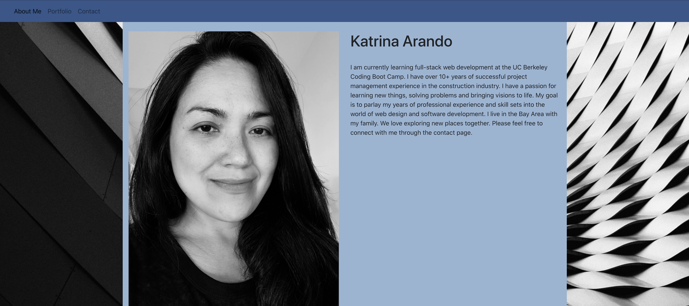
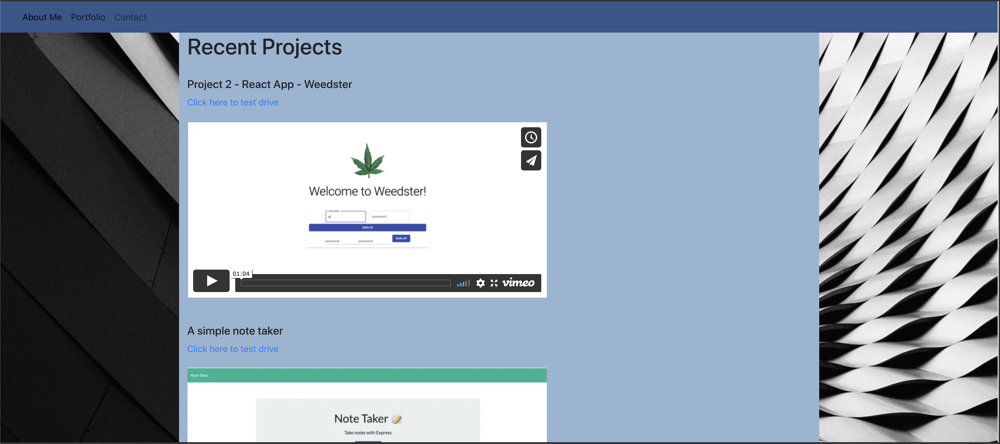
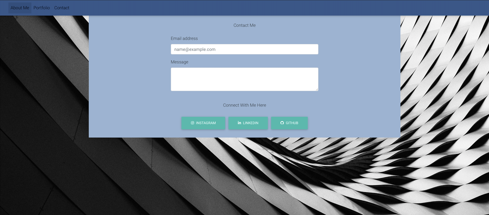

# React Portfolio

This is my updated Portfolio using React. 

This project was bootstrapped with [Create React App](https://github.com/facebook/create-react-app) and utilizes Bootstrap React. The app is hosted by Heroku. 

The app runs in development mode through 'npm start'.  To view in the browser, open [http://localhost:3000](http://localhost:3000) to view it in the browser. The page reloads when edits are made. 

## Screenshots

